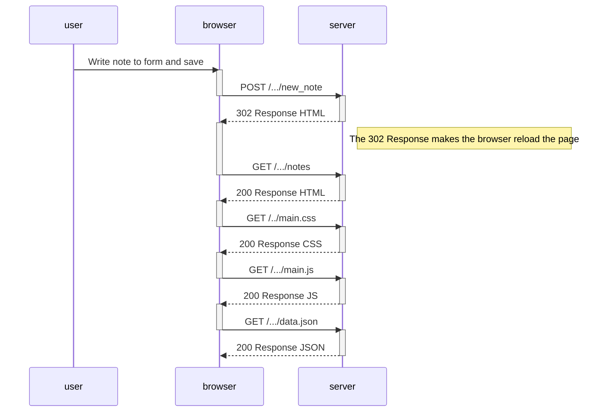

```mermaid
sequenceDiagram
    participant user
    participant browser
    participant server

    user->>browser: Write note to form and save
    activate browser
    browser->>server: POST /.../new_note
    deactivate browser

    activate server
    server-->>browser: 302 Response HTML
    deactivate server
    activate browser

    Note right of server: The 302 Response makes the browser reload the page
    browser->>server: GET /.../notes
    deactivate browser

    activate server
    server-->>browser: 200 Response HTML
    deactivate server

    activate browser
    browser->>server: GET /../main.css
    deactivate browser

    activate server
    server-->>browser: 200 Response CSS
    deactivate server

    activate browser
    browser->>server: GET /.../main.js
    deactivate browser

    activate server
    server-->>browser: 200 Response JS
    deactivate server

    activate browser
    browser->>server: GET /.../data.json
    deactivate browser

    activate server
    server-->>browser: 200 Response JSON
    deactivate server
```
