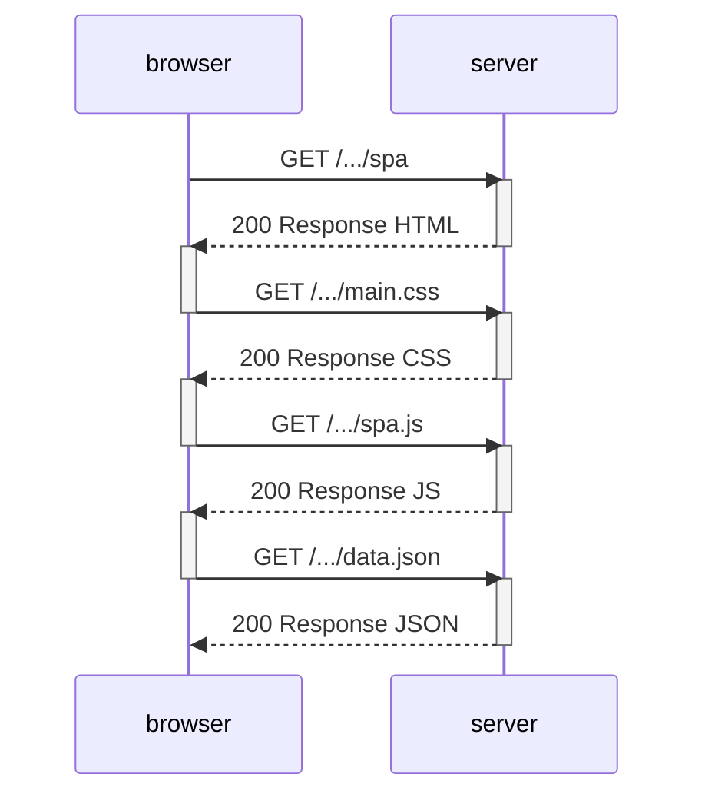

```mermaid
sequenceDiagram

participant browser
participant server

browser->>server: GET /.../spa
activate server
server-->>browser: 200 Response HTML
deactivate server

activate browser
browser->>server: GET /.../main.css
deactivate browser

activate server
server-->>browser: 200 Response CSS
deactivate server

activate browser
browser->>server: GET /.../spa.js
deactivate browser

activate server
server-->>browser: 200 Response JS
deactivate server

activate browser
browser->>server: GET /.../data.json
deactivate browser

activate server
server-->>browser: 200 Response JSON
deactivate server

```
